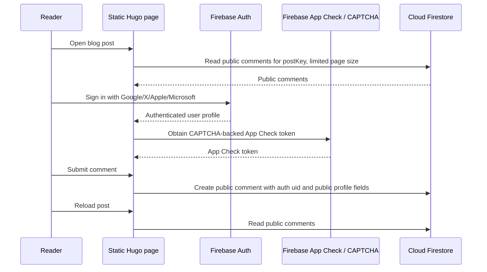

# feat: Add social-login blog comments

## Overview

Replace the current GitHub-only Giscus comment experience with a site-owned `#conversation` section where readers can sign in with X/Twitter, Google, Apple, or Microsoft and leave public comments on blog posts.

The recommended implementation uses Firebase Auth for social login, Firebase App Check backed by reCAPTCHA for write-abuse protection, and Cloud Firestore for comment storage. This preserves the static Hugo/GitHub Pages deployment model while adding the authentication and persistence layer that a static site cannot provide by itself.

---

## Resolved Issues

- V1 will support all four requested providers: X/Twitter, Google, Apple, and Microsoft. Launching with only a subset is not considered complete.
- V1 will omit moderation. Comments become public after authenticated submission and CAPTCHA/App Check verification.
- CAPTCHA must be enforced through Firebase App Check or an equivalent trusted backend check; client-only CAPTCHA is not sufficient to protect Firestore writes.
- Existing Giscus discussions should remain visible during the v1 transition while the new conversation section is introduced.

---

## Problem Frame

Readers currently need a GitHub account to comment because comments are embedded through Giscus in `layouts/_default/single.html`. That excludes readers who do not use GitHub and makes the comment UI feel developer-centric for a general personal blog.

The desired experience is closer to a conventional article conversation section: readable comments below the post, a small sign-in prompt, and familiar consumer login providers. The referenced Scott H Young page appears to use Disqus via `#comment-anchor` and `#disqus_thread`, but the product goal here is broader provider support and more direct control than Disqus/Giscus provide.

---

## Requirements Trace

- R1. Render a post-level `section#conversation` for blog comments.
- R2. Allow readers to sign in with X/Twitter, Google, Apple, or Microsoft.
- R3. Let authenticated readers submit comments for the current post.
- R4. Show public comments to anonymous readers without exposing commenter email addresses.
- R5. Require CAPTCHA/App Check verification before accepting comment writes.
- R6. Do not expose commenter email addresses publicly.
- R7. Keep the Hugo site deployable as a static GitHub Pages site.
- R8. Preserve or improve the current article-width layout of the comment section.
- R9. Avoid unnecessary read/write amplification that could create avoidable Firebase cost.
- R10. Document provider setup, CAPTCHA/App Check enforcement, Firestore security, rollback, and expected cost.

---

## Scope Boundaries

- Do not build nested replies in v1.
- Do not add reactions, voting, notifications, or subscriptions in v1.
- Do not migrate existing Giscus discussions in v1; keep the existing Giscus embed visible temporarily during the transition.
- Do not build a moderation queue or custom admin moderation app in v1.
- Do not render Markdown or HTML from comments in v1 unless sanitization is added.
- Do not store OAuth provider access tokens in Firestore.
- Do not rely on client-only CAPTCHA checks; abuse protection must be enforced by Firebase App Check or an equivalent trusted backend check.

### Deferred to Follow-Up Work

- Migration or removal of Giscus: separate follow-up after the new conversation section has enough usage history to replace it fully.
- Dedicated moderation UI: follow-up if the CAPTCHA-only public comment model proves insufficient.
- Additional spam automation or rate limiting: follow-up if CAPTCHA/App Check is not enough for real traffic.

---

## Context & Research

### Relevant Code and Patterns

- `layouts/_default/single.html` currently embeds Giscus directly after the main article container via a hard-coded `<div class="giscus-container">` and `https://giscus.app/client.js`.
- `static/css/main.css` currently has only minimal Giscus styling at the end of the file.
- `hugo.toml` has `[Params] comments = true`, so the new conversation section should respect existing site/comment enablement instead of being unconditional.
- `docs/theme-boundary.md` says `themes/beautifulhugo/` is vendor code and site-owned overrides belong under root `layouts/` and `static/`.
- `justfile` exposes `just serve`; existing verification should also use Hugo builds directly when layout changes land.

### Institutional Learnings

- No relevant `docs/solutions/` learning docs were found during planning.

### External References

- Firebase pricing lists no-cost Auth usage up to 50K monthly active users for non-phone authentication and Firestore no-cost usage up to 50K reads/day, 20K writes/day, 20K deletes/day, 1 GiB stored, and 10 GiB egress/month.
- Firebase web Auth supports Google, Apple, Twitter/X, and Microsoft providers.
- Firebase App Check can use reCAPTCHA providers for web apps and can be enforced for Firebase services such as Firestore.
- Apple Sign in setup may require Apple Developer Program membership, currently listed by Apple as $99/year.
- The referenced Scott H Young page fetch showed Disqus embeds (`#disqus_thread`) rather than a portable custom `section#conversation` implementation.

---

## Key Technical Decisions

- Use Firebase Auth plus Firestore: This gives the exact requested social providers while keeping the site static.
- Require all four providers in v1: X/Twitter, Google, Apple, and Microsoft must all be configured before production launch.
- Omit moderation in v1: Comments become public after authenticated submission and CAPTCHA/App Check verification.
- Enforce CAPTCHA/App Check for writes: The browser may render the CAPTCHA/App Check flow, but write protection must be enforced by Firebase App Check or an equivalent trusted backend check.
- Render plain-text comments initially: This avoids XSS and sanitizer complexity in v1.
- Store comments by stable post key: Use front matter `comment_id` when present, otherwise use a slash-safe hash of `.RelPermalink`, so Firestore document IDs never contain `/`.
- Use one-shot reads with a bounded query: Loading public comments once per page and limiting the result set keeps Firebase usage predictable.
- Keep Firebase config public but provider secrets external: Firebase web app config can be emitted into the page, while OAuth secrets remain in provider/Firebase consoles.
- Use provider setup docs instead of committing secrets: The repo should describe setup values and rules, not contain private client secrets or service-account keys.

---

## Open Questions

### Resolved During Planning

- Should this copy Scott H Young's actual implementation? No. The fetched page uses Disqus, while this site needs X, Google, Apple, and Microsoft login support with better control.
- Is Firebase expected to cost money at this site's likely scale? Platform usage should be $0/month under current no-cost quotas, assuming bounded reads and normal personal-blog traffic.
- Is there a non-Firebase static-only way to support these providers? No. OAuth comments require an external identity/persistence service.
- Can v1 launch with only a subset of the four requested providers? No. X/Twitter, Google, Apple, and Microsoft are all required for v1.
- Should v1 include moderation? No. V1 uses public comments with authenticated submission and CAPTCHA/App Check write-abuse protection.
- How should v1 define stable post comment threads? Use front matter `comment_id` when present, otherwise use a slash-safe hash of `.RelPermalink`; document adding `comment_id` before changing URLs with active comments.
- What happens to existing Giscus discussions in v1? Keep both temporarily: render the new conversation section and retain the existing Giscus embed until a follow-up removes or migrates it.
- How should Firestore indexes be managed? Commit `firestore.indexes.json` and document deploying it with the Firebase backend setup.
- What auth interaction should v1 use? Use popup sign-in by default, with redirect fallback for blocked popups, mobile/provider constraints, or popup failures that Firebase identifies as redirect-appropriate.
- How explicit should UI loading/accessibility states be? Treat auth loading, comment loading, App Check unavailable, submit progress, errors, keyboard labels, and `aria-live` status updates as acceptance criteria.

### Deferred to Implementation

- Exact Firebase project identifiers: The site owner must create or provide the Firebase web app config before production enablement.
- Exact provider credentials and approvals: Google usually uses Firebase's managed Google OAuth client once the Google provider is enabled, while X/Twitter, Apple, and Microsoft require external provider credentials. X/Twitter and Apple setup may depend on current provider account approval and developer program status, but all four providers remain launch-blocking for v1.
- Exact App Check provider choice: Choose reCAPTCHA Enterprise, reCAPTCHA v3, or another Firebase-supported App Check provider based on the Firebase project configuration available at implementation time.

---

## Responsibility Split

The repo-side implementation can be completed independently by an agent once this plan is accepted. That includes the Hugo partials, client-side Firebase integration, CSS, Firestore rules, Firestore indexes, config placeholders, and setup documentation.

Production Firebase and provider setup requires the site owner's help because it depends on account-console access and provider credentials. The owner must create or select the Firebase project, create the Firebase web app, provide the public Firebase web config values, enable the required Auth providers, configure Google sign-in through Firebase Auth's default managed setup unless custom Google OAuth settings are needed, configure OAuth credentials for X/Twitter, Apple, and Microsoft, choose and configure App Check/CAPTCHA, set authorized domains and redirect URLs, and enable billing/quota alerts if using a Blaze project.

The practical sequence is:

- Implement the repo-side feature with placeholders and provider toggles.
- Configure Firebase project, Firestore, Auth, and App Check in the Firebase console.
- Smoke-test Google first because it is usually the lowest-friction provider.
- Add Microsoft, X/Twitter, and Apple credentials as account setup permits.
- Treat the feature as production-ready only after all four requested providers work on the deployed domain.

### Site Owner Firebase Setup Checklist

The site owner must complete these console/account setup steps before production launch:

1. [ ] Create or select a Firebase project for the blog.
2. [ ] Create a Firebase Web App and copy the public web config values, such as `apiKey`, `authDomain`, `projectId`, and `appId`.
3. [ ] Provide the public Firebase web config values for the repo-side Hugo/Firebase setup.
4. [ ] Keep OAuth client secrets, provider secrets, and service-account keys in Firebase/provider consoles, not in the repo.
5. [ ] Enable Cloud Firestore for the Firebase project.
6. [ ] Enable Firebase Authentication for the project.
7. [ ] Enable the Google Auth provider in Firebase; use Firebase's managed Google OAuth client unless custom Google Cloud OAuth branding, scopes, or consent behavior is required.
8. [ ] Create and configure OAuth credentials in the X/Twitter, Apple, and Microsoft provider consoles.
9. [ ] Paste the required X/Twitter, Apple, and Microsoft OAuth client IDs/secrets into the matching Firebase Auth provider settings.
10. [ ] Add the deployed blog domain and local testing domains to Firebase Auth authorized domains.
11. [ ] Configure each provider's redirect/callback URLs as required by Firebase Auth.
12. [ ] Configure Firebase App Check for the Web App using a supported CAPTCHA provider, such as reCAPTCHA Enterprise or reCAPTCHA v3.
13. [ ] Enforce App Check for Firestore before production launch so comment writes are protected by Firebase, not only by client-side CAPTCHA UI.
14. [ ] Deploy the repo-provided `firestore.rules` once the repo-side implementation adds it.
15. [ ] Deploy the repo-provided `firestore.indexes.json` once the repo-side implementation adds it.
16. [ ] Enable quota alerts or billing/budget alerts, especially if the Firebase project uses Blaze.
17. [ ] Smoke-test Google login first.
18. [ ] Smoke-test Microsoft, X/Twitter, and Apple login.
19. [ ] Verify all four providers work on the deployed GitHub Pages domain before treating the feature as production-ready.

Apple login may require Apple Developer Program membership, and X/Twitter setup may require developer account approval. These are launch dependencies because v1 requires all four providers.

### When To Bring In The AI

The site owner should do console/account steps directly and bring the AI back at these handoff points:

- After checklist steps 1-3 are done: ask the AI to wire the public Firebase web config into Hugo params, templates, and `conversation.js`. Share only public config values; do not share OAuth secrets, service-account keys, or provider secrets.
- After checklist steps 6, 7, and 10 are done: ask the AI to run the local smoke test path and confirm the Google sign-in button, redirect/popup fallback, and `#conversation` return behavior.
- After checklist steps 8-11 are done for each external provider: ask the AI to update provider toggles or docs if needed, then help verify Microsoft, X/Twitter, and Apple sign-in on the deployed GitHub Pages domain.
- After checklist step 12 is done but before step 13 is treated as production-ready: ask the AI to verify the repo-side App Check initialization, Firestore rules assumptions, and failure messaging for rejected or unavailable App Check tokens.
- After the repo-side implementation adds `firestore.rules` and `firestore.indexes.json`, and before checklist steps 14-15 are deployed: ask the AI to review and help deploy or document deployment commands, then verify anonymous reads, authenticated writes, allowed fields, max body length, and author UID spoofing protections.
- During checklist step 11, if any provider setup screen asks for redirect URLs, callback URLs, domains, scopes, or consent settings: ask the AI to derive the exact expected values from the Firebase project/auth domain and the blog deployment URL before saving changes.
- During checklist steps 17-19, if a smoke test fails: ask the AI to diagnose using browser console errors, Firebase Auth error codes, Firestore rule rejections, and App Check status. Do not paste private secrets into the chat or commit them to the repo.

The AI should not own account creation, provider approval, paid Apple Developer membership decisions, billing setup, quota alert destinations, or secret entry in provider/Firebase consoles. Those remain site-owner actions.

---

## High-Level Technical Design

> This illustrates the intended approach and is directional guidance for review, not implementation specification. The implementing agent should treat it as context, not code to reproduce.



Data shape, directionally:

```text
postComments/{postKey}/comments/{commentId}
  postKey
  body
  createdAt
  authorUid
  authorName
  authorPhotoURL
  authorProvider
```

---

## Implementation Units

- [ ] U1. **Replace the Giscus embed with a conversation partial**

**Goal:** Add a site-owned `section#conversation` that respects Hugo's existing comment enablement rules while keeping Giscus visible during the transition.

**Requirements:** R1, R7, R8

**Dependencies:** None

**Files:**
- Create: `layouts/partials/conversation.html`
- Modify: `layouts/_default/single.html`
- Modify: `hugo.toml`
- Test: `content/posts/online_python_memory_profiling.md`

**Approach:**
- Move the existing Giscus block under the same comments conditional instead of leaving it unconditional.
- Add the new conversation partial under the existing comments conditional so pages can still opt out through front matter or site config.
- Render the new conversation section before the temporary Giscus section so the site-owned experience is primary.
- Render `section#conversation` inside the same article/content column unless visual testing proves a wrapper is needed.
- Emit post metadata into `data-*` attributes: post key, title, permalink, and enabled provider list.
- Add config placeholders under `[Params]` for enabling the Firebase-backed conversation without hard-coding project-specific values in templates.

**Patterns to follow:**
- Existing comment conditional in `layouts/_default/single.html`.
- Theme-boundary rule in `docs/theme-boundary.md`: modify root `layouts/`, not `themes/beautifulhugo/`.

**Test scenarios:**
- Happy path: A normal post with comments enabled renders exactly one `section#conversation` and the temporary Giscus embed after the article content/navigation area.
- Edge case: A page with `comments: false` does not render the conversation section.
- Edge case: A page with `comments: false` does not render the Giscus client script.
- Integration: Existing post content, tags, related posts, and pager remain present after replacing the comment embed.

**Verification:**
- Representative post pages build with the new section and without theme submodule edits.

---

- [ ] U2. **Implement client-side auth and comment submission**

**Goal:** Let readers sign in with all requested providers and create public comments for the current post after CAPTCHA/App Check verification.

**Requirements:** R2, R3, R5, R6, R7, R9

**Dependencies:** U1

**Files:**
- Create: `static/js/conversation.js`
- Modify: `layouts/partials/conversation.html`
- Modify: `layouts/partials/footer.html`
- Modify: `hugo.toml`

**Approach:**
- Load Firebase browser modules only when `#conversation` exists.
- Initialize Firebase from public config emitted by Hugo.
- Add provider buttons for Google, X/Twitter, Apple, and Microsoft. All four providers are required for v1 production launch.
- Use Firebase popup sign-in first and redirect fallback when popups are blocked or the provider/browser flow requires redirect; preserve return to `#conversation` after redirect.
- After sign-in, show reader display name/avatar and a sign-out option.
- Initialize Firebase App Check with the configured CAPTCHA provider before enabling comment submission.
- On submit, write a new public comment document with current `postKey`, plain-text body, auth uid, provider id, display name, photo URL, and server timestamp.
- Do not write email addresses or provider access tokens to public comment documents.
- Disable submit for empty comments and enforce a client-side max length that matches Firestore rules.
- Show explicit states for auth initialization, comment loading, App Check/CAPTCHA unavailable, submit-in-progress, submit success, and recoverable errors.

**Patterns to follow:**
- Existing `footer.html` script-loading style for optional site features.
- Keep JS as plain static browser code because the repo has no package/bundler pipeline.

**Test scenarios:**
- Happy path: Selecting each required provider starts the corresponding Firebase sign-in flow.
- Happy path: Redirect fallback returns the reader to the same post and `#conversation` after authentication.
- Happy path: An authenticated reader with a valid App Check token can submit a non-empty comment and sees it after the comment list reloads.
- Edge case: Anonymous users cannot submit and are prompted to sign in.
- Edge case: Authenticated users cannot submit if App Check/CAPTCHA verification is unavailable or rejected.
- Edge case: Auth state initialization does not flash an incorrect anonymous prompt before Firebase resolves the current user.
- Edge case: Comment loading does not show a false empty state before the Firestore read resolves.
- Edge case: Empty or whitespace-only comments are rejected client-side.
- Edge case: Over-limit comments are rejected client-side before writing.
- Error path: Firebase sign-in or write failure shows a readable non-destructive error message.
- Integration: Submitted comments are written against the current post key, not a global comment bucket.

**Verification:**
- Auth state transitions, App Check initialization, and submission behavior work on a local Hugo page once Firebase config is provided.

---

- [ ] U3. **Read and render public comments safely**

**Goal:** Display public comments for the current post without exposing unsafe markup or private profile data.

**Requirements:** R1, R4, R6, R8, R9

**Dependencies:** U1, U2

**Files:**
- Modify: `static/js/conversation.js`
- Modify: `layouts/partials/conversation.html`
- Modify: `static/css/main.css`

**Approach:**
- Query comments for the current post ordered by creation time and limited to a conservative initial count such as 50, using the committed Firestore index configuration when required by the final query shape.
- Render comments using text nodes rather than assigning untrusted text to `innerHTML`.
- Show author display name, optional avatar, provider label, and date.
- Show an empty state when no comments exist.
- Keep pagination or "load more" as a simple follow-up if a post exceeds the initial limit.

**Patterns to follow:**
- Existing responsive article styles in `static/css/main.css`.
- Existing Giscus CSS section can be replaced by a larger conversation CSS section.

**Test scenarios:**
- Happy path: Public comments for the current post render in chronological order.
- Edge case: No comments renders a friendly empty state, not a broken container.
- Edge case: Comment text containing HTML-like content is displayed as text and does not execute or create markup.
- Edge case: A missing avatar falls back to initials or a neutral visual treatment.
- Integration: A post reads only its own comments based on post key.

**Verification:**
- The rendered conversation is readable, article-width aligned, and safe from obvious comment-body HTML injection.

---

- [ ] U4. **Add Firestore rules and CAPTCHA/App Check documentation**

**Goal:** Make the backend security and abuse-prevention model explicit and reproducible before the feature is used publicly.

**Requirements:** R4, R5, R6, R9, R10

**Dependencies:** U2, U3

**Files:**
- Create: `docs/social-comments.md`
- Create: `firestore.rules`
- Create: `firestore.indexes.json`

**Approach:**
- Document Firebase project creation, all four provider setups, allowed domains, App Check/CAPTCHA setup, and where public Firebase web config goes.
- Document the responsibility split: agent-owned repo changes versus site-owner-owned console credentials, provider approvals, authorized domains, and billing/quota alert setup.
- Document that provider secrets belong in Firebase/provider consoles, not the repo.
- Add Firestore rules that let anyone read public comments and let authenticated users create comments for themselves only when App Check enforcement is enabled for Firestore.
- Add `firestore.indexes.json` for the bounded chronological comment query and document deploying it with Firebase CLI.
- Document that v1 intentionally has no moderation queue: comments are public after authenticated, CAPTCHA/App Check-verified submission.
- Document cost guardrails and quotas.

**Patterns to follow:**
- Existing docs style under `docs/theme-boundary.md` and `docs/agents/*.md`.
- Keep operational documentation concise and repo-relative.

**Test scenarios:**
- Happy path: Anonymous users can read public comments.
- Happy path: Authenticated users can create a public comment with their own uid when App Check enforcement accepts the request.
- Error path: Authenticated users cannot create comments when App Check/CAPTCHA verification is unavailable or rejected.
- Error path: Authenticated users cannot spoof another `authorUid`.
- Error path: Authenticated users cannot write email, provider token, or unsupported fields.
- Error path: Over-limit comment bodies are rejected by rules.
- Integration: The documented Firebase setup enforces App Check for Firestore writes before production launch.
- Integration: Firestore indexes can be deployed from the committed `firestore.indexes.json` without relying on console-only setup.

**Verification:**
- Rules and docs are sufficient for a future implementer/site owner to configure the Firebase backend without guessing the security or abuse-prevention model.

---

- [ ] U5. **Style and verify the conversation UI**

**Goal:** Make the conversation section feel native to the blog and verify the static site still builds cleanly.

**Requirements:** R1, R2, R3, R5, R7, R8, R10

**Dependencies:** U1, U2, U3, U4

**Files:**
- Modify: `static/css/main.css`
- Test: `layouts/_default/single.html`
- Test: `layouts/partials/conversation.html`
- Test: `content/posts/online_python_memory_profiling.md`
- Test: `content/posts/trip-to-jp.md`

**Approach:**
- Replace `.giscus-container` rules with `.conversation` styles for the section, auth controls, provider buttons, textarea, CAPTCHA/App Check state, error message, and comment list.
- Keep the layout aligned with the article column and comfortable on mobile.
- Add accessible focus states for provider buttons, submit, sign-out, and comment links if any are introduced.
- Add dark-mode styles using the existing `prefers-color-scheme` pattern in `static/css/main.css`.
- Verify with representative posts and a clean Hugo build.

**Patterns to follow:**
- Existing CSS organization in `static/css/main.css`.
- Existing post layout and typography from BeautifulHugo overrides.

**Test scenarios:**
- Happy path: Desktop conversation section appears as a polished article-width block after a post.
- Happy path: Mobile conversation section remains readable and all controls are tappable.
- Edge case: Long author names and long comment bodies wrap without breaking layout.
- Edge case: Dark mode keeps sufficient contrast for text, borders, controls, and states.
- Edge case: CAPTCHA/App Check loading or rejection states are clear and do not look like successful submission.
- Edge case: Provider buttons, sign-out, textarea, and submit have accessible names and keyboard focus states.
- Edge case: Loading, submit success, App Check failure, and write/auth errors are announced through appropriate `aria-live` status regions.
- Error path: Auth/write errors are visually distinct without shifting the whole page unexpectedly.
- Integration: Hugo builds produce the expected JS and CSS assets without introducing a package/build pipeline.

**Verification:**
- `hugo --printI18nWarnings --printPathWarnings` succeeds.
- `hugo --destination /tmp/roaming-public --cleanDestinationDir` succeeds.
- Representative generated post pages include the new conversation section and load the expected static JS/CSS assets.

---

## System-Wide Impact

- **Interaction graph:** Hugo templates emit the static container, config, and temporary Giscus embed; `conversation.js` handles auth, App Check initialization, Firestore reads, and writes.
- **Error propagation:** Client-side auth/read/write failures should remain localized to `#conversation` and never block article rendering.
- **State lifecycle risks:** Public comments appear without moderation; active threads need stable `comment_id` values before URL changes so conversations are not orphaned unexpectedly.
- **API surface parity:** The comments front matter/site param behavior should remain consistent with existing Hugo comment toggles.
- **Integration coverage:** Manual browser verification with a real Firebase project is needed because OAuth redirects cannot be fully proven by Hugo build output.
- **Unchanged invariants:** Blog content remains statically generated; GitHub Pages deployment remains the hosting model; theme vendor code remains untouched.

---

## Risks & Dependencies

| Risk | Mitigation |
|------|------------|
| Apple login requires paid Apple Developer Program membership | Treat Apple setup as a v1 launch dependency; document the likely $99/year cost and do not mark the feature complete until Apple login works. |
| X/Twitter developer setup changes or blocks OAuth setup | Treat X/Twitter setup as a v1 launch dependency; defer the feature launch rather than shipping a subset of providers. |
| Public comments can be abused despite authentication | Enforce Firebase App Check/CAPTCHA for Firestore writes before launch; add stronger rate limiting or moderation later if real traffic requires it. |
| Client-only CAPTCHA can be bypassed | Use Firebase App Check enforcement or an equivalent trusted backend gate, not a UI-only CAPTCHA flag. |
| Firebase read/write amplification increases cost | Use bounded one-shot comment reads, enforce max body length and allowed fields in rules, and enable quota/budget alerts. |
| Public Firebase config is mistaken for a secret | Document that Firebase web config is public, while provider secrets/service-account keys must not be committed. |
| Custom comments increase maintenance compared with Giscus | Keep v1 minimal: flat comments, plain text, no moderation UI, no custom backend server unless App Check proves insufficient; remove or migrate Giscus in a follow-up. |

---

## Documentation / Operational Notes

- Expected Firebase platform usage for a personal blog should be $0/month under current no-cost quotas if reads are bounded.
- Apple Sign in may add $99/year if an Apple Developer Program membership is required.
- The site owner should enable billing alerts or quota alerts before public launch if using a Blaze project.
- Repo-side work can be prepared without Firebase console access, but production enablement is blocked until the site owner provides Firebase web config and completes provider/App Check setup.
- The docs should include a simple rollback path: disable Firebase comments in `hugo.toml`; the temporary Giscus embed remains available during v1.
- Privacy copy should tell readers their public display name/avatar may appear, comments are public after submission, and email addresses are not shown publicly.

---

## Sources & References

- Related code: `layouts/_default/single.html`
- Related code: `static/css/main.css`
- Related config: `hugo.toml`
- Theme ownership: `docs/theme-boundary.md`
- Firebase pricing: `https://firebase.google.com/pricing`
- Firebase Auth limits/providers: `https://firebase.google.com/docs/auth/limits`
- Firebase Firestore billing: `https://firebase.google.com/docs/firestore/pricing`
- Firebase App Check for web: `https://firebase.google.com/docs/app-check/web/recaptcha-provider`
- Apple Developer Program: `https://developer.apple.com/programs/`
- Reference page inspected: `https://www.scotthyoung.com/blog/2026/05/11/utopia-now/`
